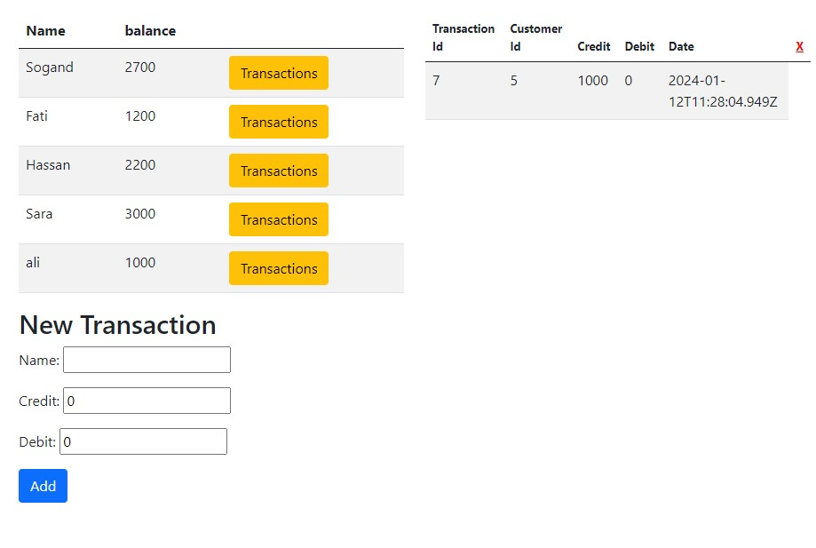

# project-2

## Book Keeping System

Record keeping can help you to find the information you need. It promotes the creation of full and accurate records in the first place. It also involves storing and managing records appropriately so that the information will be available to you when you need it. I wrote a book keeping system using JS , HTML, bootstrap and few inline css. very simple and easy to use for everyone specifically for the users requested.
Welcome to Grandma's Money Manager, a user-friendly and straightforward system designed with simplicity in mind.
As if now there is not any persistent storage media to stor data so it will lose data after each run.

## Overview

Managing finances can be overwhelming, so I've created this easy-to-use money bookkeeping system to help user to keep track and record their financial transactions. The system is designed to be user-friendly, allowing users to easily add new transactions and view their financial history.

## Features

- **User-Friendly Interface:** No need to worry about complicated technology. system is designed with buttons and clear fonts, making navigation a breeze.

- **Quick Data Entry:** Add the name and add the debit and credit.. No confusing forms or jargon.

- **Clear Categories:** Everything is neatly organized, so you can easily see where your money is going.

# Planning stage

## Target Audiences:

As I explained in the introduction, I created this system for the users who are not good at managing their money. I also created this system for the users who are not good with the technology. That is why it is very easy to use and understand.also, I am going step by step with users need to improve the system.

### Responsive

https://ui.dev/amiresponsive?url=https://rahijalali.github.io/project-2/

### Features

- Add New Record : in New Transaction you can add the name and add the debit and credit, then press the add button. it will store in the database.
  

- Delete Record: you can delete the record by clicking the delete button.(if it now can delete the record by admin)
- Update Record: you can update the record by clicking the update button.( features for future)
- filter by ID : ( features for future will be added by user request)

### Technologies

- HTML
- CSS (inline)
- JS
- Bootstrap

### Live Demo

https://rahijalali.github.io/project-2

### Testing

Validator Testing

- HTML : no errors were returned when passing through the validator[ W3C validator]
  
- Js : no errors were returned when passing through the validator https://jshint.com/
- lighthouse
  

### Deployment

- this site was deployed to GitHub pages.
- in the Github repository there is a folder named project-2.
- from the source section drop-down menu the main branch.

### Unfixed Bugs

There is not unfixed bugs
