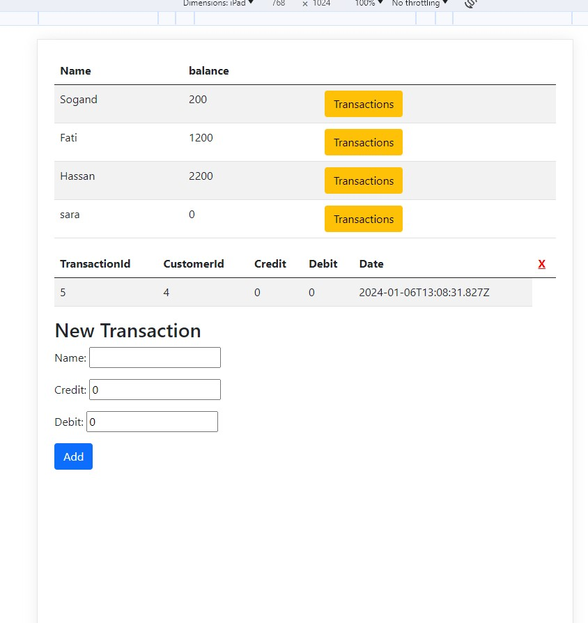
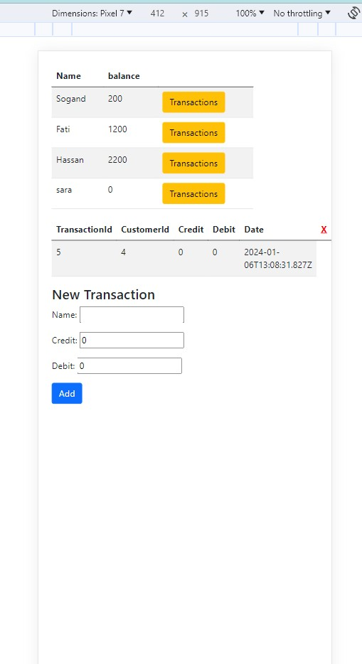
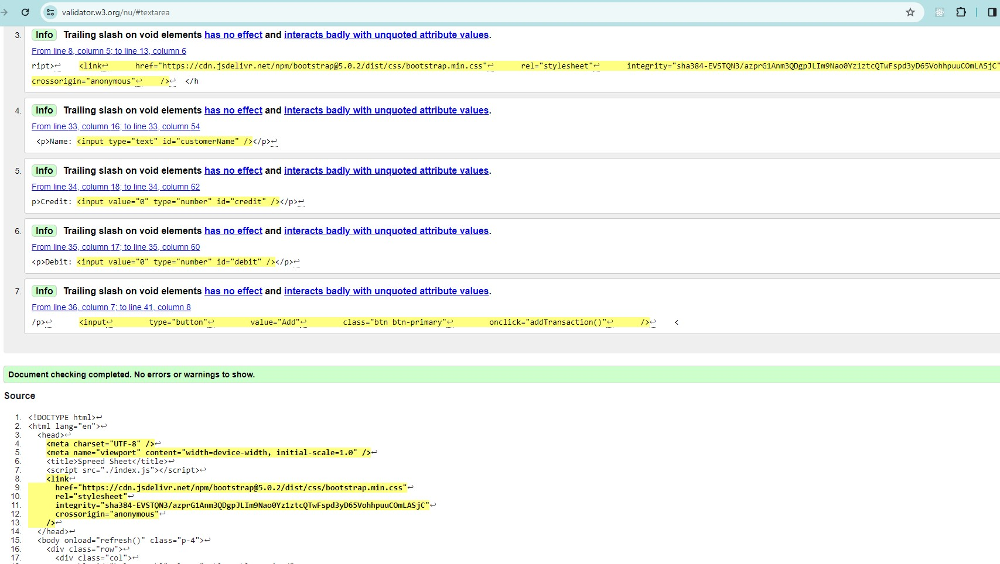
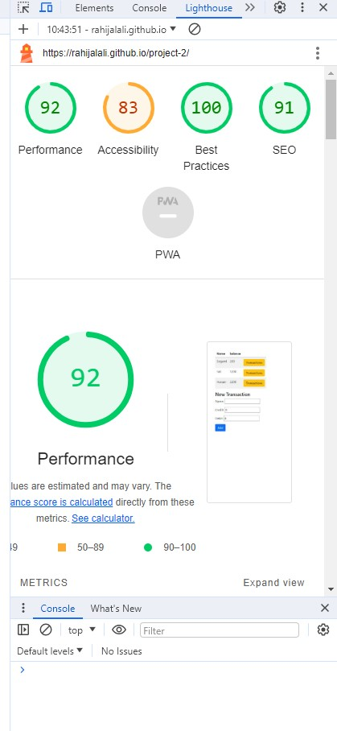

# project-2

## Book Keeping System

Record keeping can help you to find the information you need. It promotes the creation of full and accurate records in the first place. It also involves storing and managing records appropriately so that the information will be available to you when you need it. I wrote a book keeping system using JS , HTML, bootstrap and few inline css. very simple and easy to use for everyone specifically for the users requested.
As if now there is not any persistent storage media to stor data so it will lose data after each run.

### Responsive

https://ui.dev/amiresponsive?url=https://rahijalali.github.io/project-2/

### Features

- Add New Record
- Delete Record
- Update Record
- filter by ID

### Technologies

- HTML
- CSS (inline)
- JS
- Bootstrap

### Live Demo

https://rahijalali.github.io/project-2

### Testing

Validator Testing

- HTML : no errors were returned when passing through the validator[ W3C validator]
  
- Js : no errors were returned when passing through the validator https://jshint.com/
- lighthouse
  

### Deployment

- this site was deployed to GitHub pages.
- in the Github repository there is a folder named project-2.
- from the source section drop-down menu the main branch.

### Unfixed Bugs

There is not unfixed bugs
